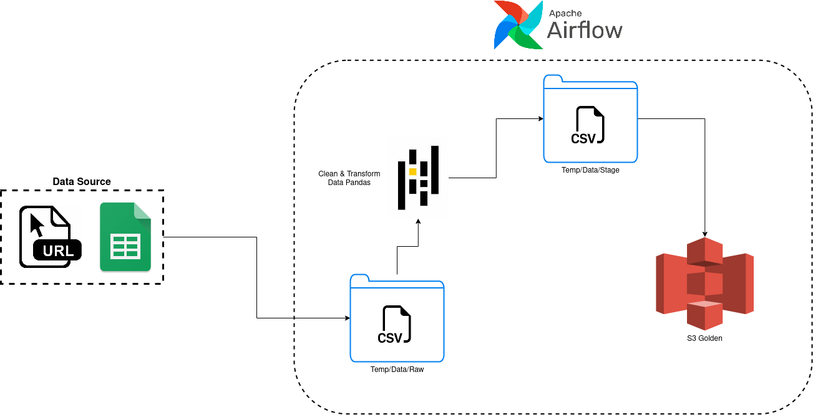

Overview
========

Esta es la solución del Challenge Ingeniero de Datos Semi-Senior-2

Project Contents
================

Este proyecto contiene los siguientes archivos y carpetas:

- dags: Esta carpeta contiene los archivos python de cada flujo de Airflow, Este directorio incluye dos subdirectorios:
    - `data_process` : que contiene el flujo de trabajo relacionado a la prueba, así como sus componentes. 
    - `example_dags`: Son ejemplo basicos de flujo de trabajo que vienen por defecto en airflo.
- Dockerfile: Este archivo contiene la imagen docker de airflow 2.5.0, ademas de proporcionar la instalación de paquetes y dependecias especificas para el desarrollo de  esta prueba.
- include: Esta carpeta contiene cualquier archivo adiciona que se requiera incluir como parte del proyecto, Esta vacio por defecto.
- packages.txt: Instala paquetes en el sistema operativo necesarios para este proyecto.
- requirements.txt: Instala las dependecias de python necesarias para este proyecto.
- plugins: Añade plugins personalizado o de comunidad, para este ocasión no es necesario, por ende viene vacio.
- docker-compose.yaml: Se usa este archivo para especificar las conexiones, Variables, Base de datos, ejecutor, trabajador, etc. Con el fin de construir satisfactoriamente un contenedor localmente.

Deploy Your Project Locally
===========================

1. Como prerequisito para este proyecto se necesita tener instalado:
    - `Docker Desktop`

2. Una vez verificado este requerimiento y clonado el repositorio en local ejecutar:
    - `docker compose up airflow-init` --> Con el fin crear el contenedor con todas sus dependencias 
    - `docker compose up --build` --> Con el fin correr el contenedor con todas sus dependencias 

Este comando activará 7 contenedores Docker en su máquina, cada uno para un componente Airflow diferente:

- Postgres: Airflow's Metadata Database
- Webserver: The Airflow component responsible for rendering the Airflow UI
- Scheduler: The Airflow component responsible for monitoring and triggering tasks
- Triggerer: The Airflow component responsible for triggering deferred tasks
- Redis: Servicio de Encolamiento
- Worker: Ejecutor de Celery, para este caso.
- Init: Iniciliazador 

3. Verifique que los 4 contenedores Docker se crearon ejecutando 'docker ps'.

Note: Corriendo '`docker compose up --build`' usted comenzara su proyecto de Airflow Webserver expuesto en el puerto 8080 and Postgres expuesto en el puerto 5432. Si ya tiene alguno de esos puertos asignados, puede detener sus contenedores Docker existentes o cambiar el puerto.

4. Para acceder la interfaz Airflow UI para su proyector local de Airflow. Para hacerlo, vaya a http://localhost:8080/ and log in con 'airflow' tanto para su nombre de usuario como para su contraseña.

También debería poder acceder a su base de datos de Postgres en Postgres Database at 'localhost:5432/postgres'.

NOTA: Una alternativa para desplegar facilmente un ambiente local de airflow, es usar '`astro cli`', el proceso para instalarlo se encuentra en el [GUIA DE INSTALACION ASTRO](https://docs.astronomer.io/astro/cli/install-cli), ejecutado el comando `astro dev int` para inicializar el proyecto, posteriormente a ello copie la carpeta 'dag' al proyecto inicializado con astro, ademas de verificar los paquetes y dependencias. Una vez realizado esto, puede correr el proyecto ejecutando el comando `astro dev start`

Workflow airflow 
===========================

